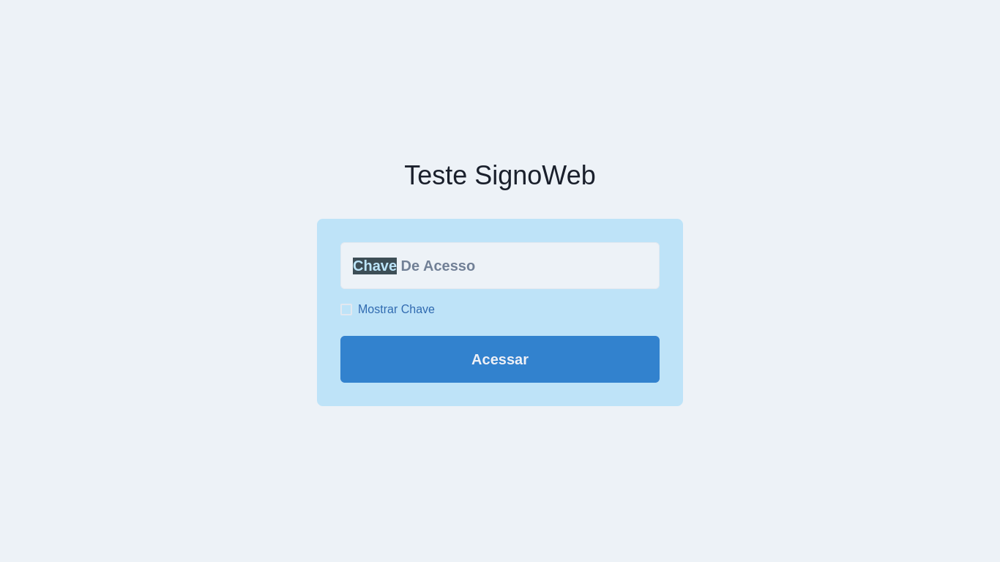
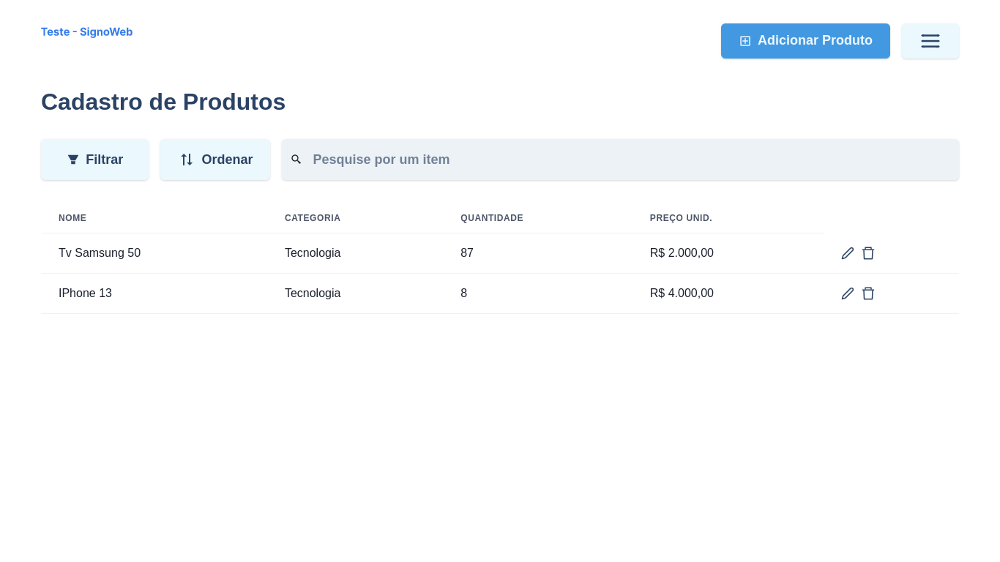

<h1 align="center">
    <a href="#" alt="site do ecoleta"> Desafio SignoWeb </a>
</h1>

 <p align="center"> Cadastro de pedidos de compra.. </p>


 <h4 align="center">
	🚧   Concluído... 🚀 🚧
</h4>


[](https://www.linkedin.com/in/jonas-martins-950a30184/)


Tabela de conteúdos
=================
   * [Funcionalidades](#-funcionalidades)
   * [Layout](#-layout)
     * [Web](#web)
   * [Como executar o projeto](#-como-executar-o-projeto)
     * [Pré-requisitos](#pré-requisitos)
     * [Rodando o Backend (servidor)](#rodando-o-back-end)
     * [Rodando a aplicação web (Frontend)](#user-content--rodando-a-aplicação-web-frontend)
   * [Tecnologias](#-tecnologias)

---

## Funcionalidades

- [x] CRUD de clientes.
- [x] CRUD de produtos.
- [x] CRUD de pedidos de compra,com status (Em Aberto, Pago ou Cancelado).


### Web
<p align="center" style="display: flex; align-items: flex-start; justify-content: center;">
  

  
</p>

---


## 🚀 Como executar o projeto
Este projeto é divido em duas partes:
1. Backend (pasta server) 
2. Fe (pasta web)


💡O Frontend precisa que o Backend esteja sendo executado para funcionar.


<hr />

### Pré-requisitos

Antes de começar, você vai precisar ter instalado em sua máquina as seguintes ferramentas:
[Git](https://git-scm.com), [Node.js](https://nodejs.org/en/), [Docker](https://www.docker.com). 
Além disto é bom ter um editor para trabalhar com o código como [VSCode](https://code.visualstudio.com/)


### 🎲 Rodando o Back End (servidor)
```bash
# Clone este repositório
$ git clone <https://github.com/jonasmartinsdev/vaga-desenvolvedor.git>

# Acesse a pasta do projeto no terminal/cmd
$ cd vaga-desenvolvedor
$ cd backend

# Instale as dependências
$ npm i

# Renomeie .env.example para .env

# Criação do banco de dados utilizando o docker compose

$ docker-compose up

# Execute as migration e seed
$ npx prisma migrate dev

# Execute a aplicação em modo de desenvolvimento
$ npm run dev

# O servidor iniciará na porta:3333 - acesse <http://localhost:3333>
```


### 🎲 Rodando o Front End

```bash
# Clone este repositório
$ git clone <https://github.com/jonasmartinsdev/vaga-desenvolvedor.git>

# Acesse a pasta do projeto no terminal/cmd
$ cd vaga-desenvolvedor
$ cd fe

# Instale as dependências
$ npm i

# Execute a aplicação em modo de desenvolvimento
$ npm run dev


# Login do admin
$ chave: jonas@dev
```

---


## Como foi feito:
Para criar a interface, utilizer o Next.js e o ChakraUi.
O Cliente esta sendo conectado a uma API feita usando o Node.js e PostgreSQL.


## 🚀 Tecnologias usadas no projeto

- Next.js
- TypeScript
- ChakraUI
- Node.js
- PostgreSQL
- Prisma

---


Feito com ❤️ por Jonas Martins 👋🏽 [Entre em contato!](https://www.linkedin.com/in/jonas-martins-950a30184)

---