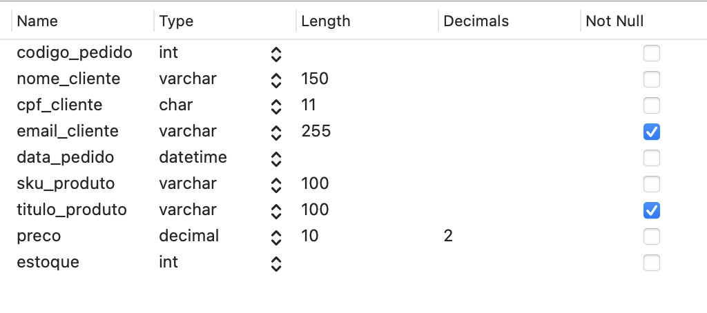
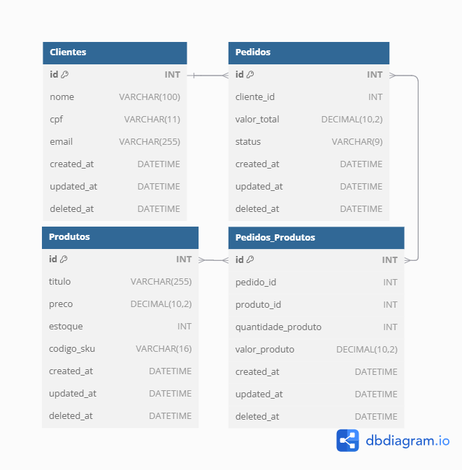

<div align="center">
  
</div>

# Sistema de Pedidos de Compra


## Funcionalidades Implementadas

**CRUD de Clientes**
- Criar, visualizar, editar e excluir clientes.
- Campos disponíveis: **Código, Nome, E-mail, CPF**.  
- Filtros de pesquisa por **Código, Nome, E-mail e CPF**. 
- Validação de campos para evitar valores inválidos.
- Ordenação crescente/decrescente.  
- Paginação com personalização da quantidade de itens por página.

**CRUD de Produtos**  
- Criar, visualizar, editar e excluir produtos.
- Campos disponíveis: **Código, Título, Preço, Estoque e Código SKU**.  
- Filtros de pesquisa por **Código, Título, Preço, Estoque e Código SKU**. 
- Validação de campos para evitar valores inválidos.
- Ordenação crescente/decrescente.  
- Paginação com personalização da quantidade de itens por página.

**CRUD de Pedidos**  
- Criar, visualizar, editar e excluir pedidos.
- Campos disponíveis: **Código, Cliente, Valor, Status, Data e Produtos**.  
- Filtros de pesquisa por **Código, Cliente, Valor, Status, Data e Produtos**. 
- Possui status: **Em Aberto, Pago e Cancelado**.  
- Vinculação obrigatória a um cliente.  
- Permite adicionar múltiplos produtos a um pedido.  
- Cada produto possui uma quantidade específica no pedido.
- Validação do estoque: impede adicionar produtos sem estoque suficiente.

## Instalação

Siga os passos abaixo para rodar o sistema localmente:

1 - Clonar o repositório:
```bash
git clone https://github.com/eduardoranucci/vaga-desenvolvedor.git
cd vaga-desenvolvedor
git switch EduardoHenriqueRanucciMoreira
```

2 - Instale as dependências do Laravel
```bash
composer install
```

3 - Copie o arquivo de configuração do ambiente:
```bash
cp .env.example .env
```

4 - Crie o banco de dados SQLite:
```bash
touch database/database.sqlite
```

5 - Gere a chave do app:
```bash
php artisan key:generate
```

6 - Execute as migrações e seeds do banco:
```bash
php artisan migrate --seed
```

7 - Inicie o servidor:
```bash
php artisan serve
```

O sistema estará rodando em http://127.0.0.1:8000

## Modelo de dados

Modelagem inicial:



Nova modelagem:



## Tecnologias utilizadas

- HTML
- CSS 
- Bootstrap
- Javascript
- Framework Laravel (PHP)
