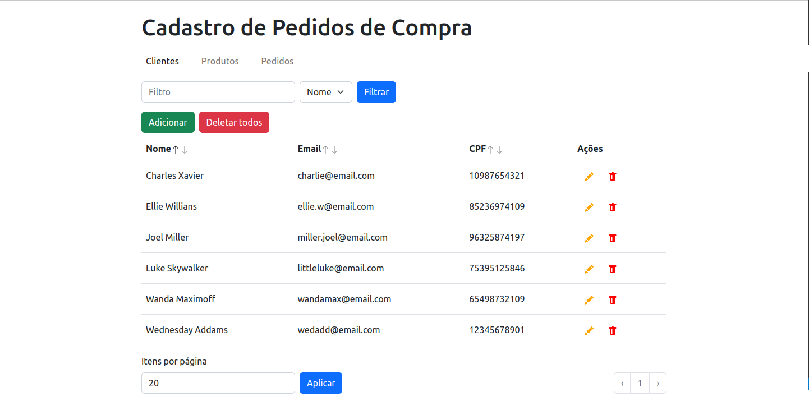

# Cadastro de Pedidos de Compra

<div align="center">
  
</div>


## Tecnologias utilizadas

- **Ferramentas:** Docker e Git.
- **Linguagens, frameworks, bibliotecas e afins:** JavaScript, Node.js, Express.js, Sequelize, React, React Router e Bootstrap (React-Bootstrap).
- **Banco de dados:** MySQL.


## Dependências

Você precisará de [Git](https://git-scm.com/downloads), [Docker](https://docs.docker.com/engine/install/) e [Docker Compose](https://docs.docker.com/compose/install/) instalados em sua máquina para executar a aplicação.


## Como rodar a aplicação

1. No terminal, clone o repositório:
```sh
git clone https://github.com/nataelienai/signoweb-vaga-desenvolvedor.git
```

2. Entre na pasta do repositório clonado:
```sh
cd drone-feeder
```

3. Inicialize a aplicação com o Docker Compose:
```sh
docker compose up --build
```

- Na primeira execução, a inicialização da aplicação pode levar alguns minutos. Aguarde até que apareça no terminal as seguintes linhas:

```
frontend  |   VITE v4.0.2  ready in 675 ms
frontend  | 
frontend  |   ➜  Local:   http://localhost:3000/
frontend  |   ➜  Network: http://172.22.0.3:3000/
```

4. Após a inicialização, acesse o endereço `http://localhost:3000` no seu navegador para abrir a aplicação.

- Para encerrar a execução, pressione as teclas `Ctrl + C` no terminal.
